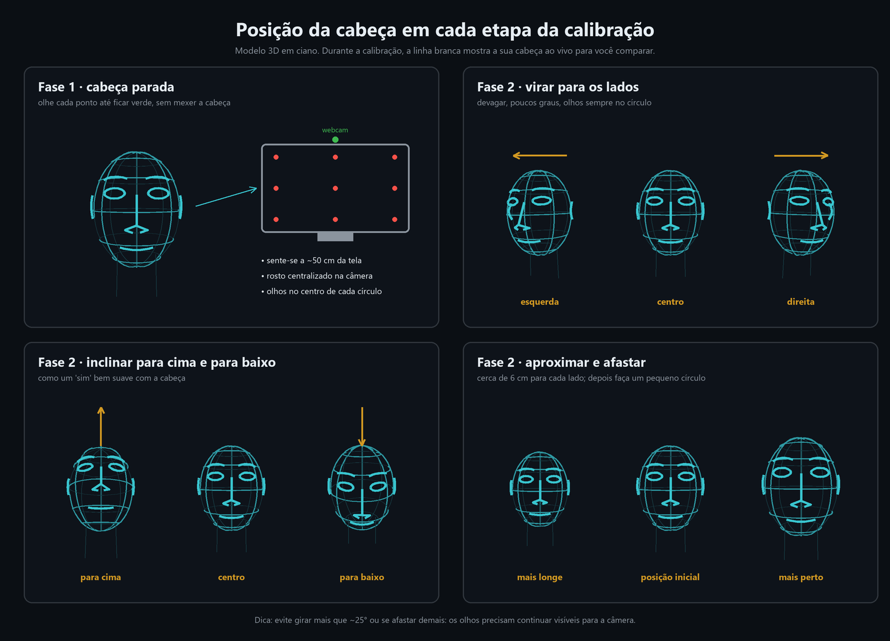

# EyeMouse

Mouse controlado pelo **olhar** (webcam comum), com **cliques por pinça de mão**. Funciona 100% local, sem internet
depois da primeira execução (que baixa dois modelos do MediaPipe).

- **Olhar → cursor**: o cursor segue para onde você olha; uma *bolha* translúcida mostra o ponto estimado (como no GazeRecorder).
- **Clique esquerdo**: pinça do **polegar com o indicador**. **Clique direito**: pinça do **polegar com o médio**.
  Segure a pinça por mais de ~0,35 s para **arrastar**.
- **Calibração em tela cheia** que aprende: cada calibração, teste ou clique de correção **acumula** amostras.
- **Suporte a movimento da cabeça**: a calibração tem uma 2ª fase em que você mexe a cabeça enquanto olha os pontos.
- **Tela de imagem**: ajustes de brilho/contraste/gama/CLAHE/nitidez e o painel da câmera, para o olho ficar bem contrastado.



## Instalador (Windows)

Para quem só quer usar: rode `EyeMouse-Setup-<versão>.exe` (não precisa de Python). Ele instala por usuário (sem pedir
administrador), cria o atalho no Menu Iniciar, já traz os modelos do MediaPipe (funciona offline) e tem desinstalador.
Sua calibração e configurações ficam em `%APPDATA%\EyeMouse` e só são apagadas se você aceitar na desinstalação.

- O instalador não é assinado digitalmente: o SmartScreen pode avisar. Use *Mais informações → Executar assim mesmo*.
- `EyeMouse-console.exe` (na pasta instalada) é o mesmo programa com console: `EyeMouse-console.exe --doctor` diagnostica
  câmera e detecção. Erros do app instalado são gravados em `%APPDATA%\EyeMouse\eyemouse.log`.

**Gerar o instalador** (o `.exe` não é versionado no git, pasta `dist/`):

```bat
.venv\Scripts\pip install -r requirements-build.txt
winget install JRSoftware.InnoSetup
build_installer.bat
```

Isso roda o PyInstaller (`EyeMouse.spec` → `build\dist\EyeMouse`, ~300 MB) e depois o Inno Setup (`installer\eyemouse.iss`
→ `dist\EyeMouse-Setup-<versão>.exe`, ~95 MB). `build_installer.bat --skip-installer` gera só a pasta do aplicativo.
A versão vem de `eyemouse/__init__.py`.

## Instalar e executar (desenvolvimento)

```bat
python -m venv .venv
.venv\Scripts\pip install -r requirements.txt
run.bat
```

Na primeira execução são baixados `face_landmarker.task` (~4 MB) e `hand_landmarker.task` (~8 MB) para `data/`.
Requer Windows e Python 3.10+ (testado no 3.13).

Comandos úteis:

| Comando | O que faz |
|---|---|
| `run.bat` | abre o painel; se não houver calibração, abre a calibração automaticamente |
| `run.bat --calibrate` | abre a calibração ao iniciar |
| `run.bat --doctor` | testa câmera, modelos e taxa de detecção de rosto/mão (sem interface) |
| `run.bat --reset` | apaga a calibração salva |
| `run.bat --camera 1` | usa outra câmera |

## Como usar (passo a passo)

1. **Imagem** (botão *Imagem e contraste dos olhos*, ou tecla `I` na calibração). Em tela cheia você vê a câmera, uma faixa
   ampliada dos olhos e um veredito ("Olhos escuros demais", "Bom contraste nos olhos ✓"…).
   - Aba **Software**: brilho, contraste, gama, CLAHE, nitidez — aplicados antes da detecção. `A` = auto-ajustar pelos olhos.
   - Aba **Câmera (driver)**: exposição, ganho, brilho, contraste, saturação, gama, nitidez, luz de fundo (lidos e gravados
     direto na câmera). `P` abre o painel nativo do Windows ("Video Proc Amp").
   - `O` alterna entre imagem original e ajustada para comparar.
2. **Calibração** (`Ctrl+Alt+C`). Tela cheia, com o modelo 3D da cabeça mostrando a posição ideal (ciano) e a sua cabeça ao vivo (branco):
   - *Fase 1*: 9/16/25 pontos com a **cabeça parada**.
   - *Fase 2* (`H` liga/desliga): 9 pontos com a **cabeça em movimento** (lados, cima/baixo, perto/longe, círculo).
     O quadrado "poses da cabeça" mostra quais poses já foram capturadas.
   - *Refinamento*: a bolha aparece ao vivo. Olhe para um ponto e **clique nele** com o mouse: vira uma amostra e o modelo
     se ajusta na hora. `T` roda um **teste guiado** (8 pontos aleatórios) que mostra o erro e já aprende com eles.
3. **Ligue o mouse**: botão *Mouse com os olhos* ou `Ctrl+Alt+E`. Ele **sempre inicia desligado**, por segurança.
4. Com o mouse desligado, cada clique físico seu (quando a bolha estava perto) também ensina o modelo
   (*Aprender com cliques do mouse*).

Atalhos globais: `Ctrl+Alt+E` liga/desliga o mouse • `Ctrl+Alt+B` mostra/oculta a bolha • `Ctrl+Alt+C` calibrar • `Ctrl+Alt+H` modo da cabeça • `Ctrl+Alt+M` modo da mão • `Ctrl+Alt+R` recentralizar a cabeça • `Ctrl+Alt+Q` sair.

## Modos de controle (painel principal)

Dois menus no painel escolhem **o que move o mouse**. O modo é salvo e vale na próxima abertura.

| Menu | Modo | O que faz |
|---|---|---|
| **Cabeça** | Olho *(padrão)* | O cursor segue o olhar. A pose da cabeça continua entrando no modelo para **compensar** o erro, mas mexer a cabeça **não move** o mouse. Precisa de calibração. |
| | Cabeça + olho | O olhar posiciona o cursor e virar a cabeça o desloca também (cabeça = movimento grosso, olho = ajuste fino). Precisa de calibração. |
| | Cabeça | O cursor segue para onde o nariz aponta, relativo a uma pose neutra. Não precisa de calibração. |
| | Desativado | Olho e cabeça **não movem** o mouse. Os gestos da mão continuam: com a mão em *Pinça* você usa o mouse físico e clica/rola com a mão; com *Mão relaxada move o cursor*, a mão também move. Não precisa de calibração. |
| **Mão** | Pinça (clique) *(padrão)* | A mão só clica: polegar+indicador = esquerdo, polegar+médio = direito, segurar = arrastar. |
| | Mão relaxada move o cursor + pinça | Basta a **mão estar visível**: ela move o cursor sem exigir nenhuma pose (não precisa apontar o dedo). A pinça clica **e a mão continua movendo o cursor durante a pinça** (é assim que se arrasta; o cursor segue o movimento *relativo* da mão a partir do clique, então o clique não vira arrasto sem querer). O **punho fechado** rola a página e para o cursor. Sem mão, vale o modo de cabeça. |

- **Recentralizar cabeça** (`Ctrl+Alt+R`): define a pose atual como o centro da tela nos modos com cabeça. Isso também acontece ao ligar o mouse e ao trocar de modo.
- **Sensibilidade do movimento** (sliders 0,3–3,0): *Cabeça*, *Mão* e *Rolagem*. O modo Olho não tem sensibilidade: sua precisão vem da calibração.
- Atalhos: `Ctrl+Alt+H` alterna o modo da cabeça, `Ctrl+Alt+M` o da mão.

## Rolagem com a mão fechada

Com a **mão fechada** (punho), mover a mão rola a página como dois dedos no touchpad: quanto mais rápido o movimento, mais intensa a rolagem
(curva superlinear; a sensibilidade é o slider *Rolagem*). Vertical e horizontal, com bloqueio de eixo (só a direção dominante rola).
Mão para baixo rola para baixo; *Inverter a direção da rolagem (natural)* troca isso. Durante a rolagem o cursor fica parado (no modo "Mão move o cursor")
e a bolha fica roxa. Pode ser desligada em *Rolar com a mão fechada*. O punho é reconhecido quando os quatro dedos estão dobrados
(medido nos dados: 0% de falsos com a mão aberta ou em pinça).

## Visão da câmera

O botão **Ver câmera (visão computacional)** abre uma janela ao vivo com o que o programa enxerga: rosto (caixa e íris), **esqueleto da mão**, estado
(*mão aberta*, *PINÇA esquerdo/direito*, *PUNHO — rolagem* com a velocidade), a distância das pontas dos dedos e a origem do cursor.
Use-a para ajustar a posição da mão: com a mão fora do quadro nada funciona (foi a causa de testes ruins). É a mesma janela usada nos testes ao vivo.

## Dicas para acertar mais

- Luz **na frente** do rosto (janela atrás de você deixa o rosto em silhueta e o rastreio falha).
- Com pouca luz a webcam alonga a exposição e cai para ~10–15 fps. Acenda uma luz ou reduza a *Exposição* na aba Câmera e compense com Ganho/Gama/CLAHE.
- Câmera na altura dos olhos, ~50 cm da tela. Se mudar de posição, refaça (ou refine) a calibração.
- Precisão realista de webcam: erro típico de 2–5% da tela. Não substitui um rastreador infravermelho.
- A câmera precisa **enxergar sua mão** para a pinça funcionar. O clique é definido pela **distância entre as pontas dos dedos**
  (ponta do polegar × ponta do indicador/médio, em unidades do tamanho da mão: 0 = encostadas, 1 = bem separadas; combina a medida na
  imagem e a 3D do MediaPipe). A tela inicial da calibração mostra o valor ao vivo de cada dedo.
- Se a pinça não disparar ou disparar sem querer, aperte **`P`** na tela inicial da calibração. O assistente (15 s) mede a sua mão aberta
  e em pinça, para indicador e médio, e define: o limiar de disparo de cada dedo (logo acima do nível de contato *da sua* pinça; o clique é **solto no primeiro quadro em que os dedos se afastam**, para a volta da mão não computar pinça) e a
  **guarda de punho**, que impede iniciar clique quando os outros três dedos estão dobrados (punho ou mão relaxada, onde o polegar
  fica perto das pontas sem intenção de clicar). Faça a pinça com os outros dedos **esticados**; se você pinça com eles dobrados,
  o assistente desliga a guarda. "Zerar calibração da pinça" está em *Configurações…*.
- Limite conhecido: se o polegar passar rapidamente por cima da ponta do indicador (sem tocar), a câmera única não distingue isso de
  uma pinça muito rápida e pode gerar um clique breve. Em gestos livres intencionalmente difíceis isso ocorreu ~1 vez a cada 6 s.
- Alterações na aba *Câmera* **persistem no driver**, afetam outros apps e são reaplicadas toda vez que o programa abre. Se a imagem
  ficar escura ou estranha, abra *Imagem e contraste* e aperte **`R` (Restaurar tudo)**: volta o driver ao estado original e zera os ajustes de software.
  O programa avisa quando a imagem está quase preta.

## Configuração

`data/config.json` (gerado automaticamente; quase tudo também está em *Configurações…*). Principais chaves:
`smoothing_min_cutoff` / `smoothing_beta` (suavização), `deadzone_px`, `bubble_size`, `pinch_on_ratio` / `pinch_off_ratio`
(sensibilidade da pinça), `drag_hold_ms`, `calibration_points`, `calibration_head`, `img_*` (imagem), `camera_props`, `camera_fourcc`.

## Como funciona

```
câmera ─► ajuste de imagem ─► MediaPipe FaceLandmarker (íris, blendshapes, pose 3D da cabeça)
                            └► MediaPipe HandLandmarker (pinça)
íris/olho + pose da cabeça ─► regressão ridge (grau 1/2/3 escolhido por validação cruzada)
                          ─► mediana + filtro 1€ ─► cursor (SetCursorPos) e bolha
pinça ─► SendInput (botão esquerdo/direito, segurar = arrastar)
```

- **Features** (11): posição da íris em coordenadas do olho (por olho), abertura da pálpebra, yaw/pitch/roll e posição da cabeça.
- **Aprendizado incremental**: o modelo guarda todas as amostras (`data/calibration.json`) e reajusta a cada nova informação;
  cada alvo tem o mesmo peso, e amostras discrepantes são atenuadas (Huber).
- O olho fechado congela o cursor (a estimativa do olhar é inválida enquanto pisca).

Arquivos: `eyemouse/` (`tracker.py` laço principal, `gaze_model.py`, `features.py`, `hands.py`, `calibration_ui.py`,
`image_ui.py`, `head3d.py`, `imaging.py`, `control.py` (modos e rolagem), `preview_ui.py` (visão da câmera), `bubble.py`, `app.py`), `tests/`, `tools/render_head_guide.py` (gera a imagem acima).

## Testes

```bat
.venv\Scripts\python -m unittest discover -s tests -t .
```

## Ideias reaproveitadas de outros projetos

[EyeTrax](https://github.com/ck-zhang/EyeTrax) (calibrações 9/5/densa, filtros, modelo persistente),
[EyeControl](https://github.com/medboughrara/EyeControl-Real-Time-Webcam-Eye-Tracking-Mouse) (FaceLandmarker + blendshapes, ridge polinomial, filtro 1€),
[eye_mouse](https://github.com/NicholasMilani/eye_mouse) (mediana + suavização + zona morta),
[edpl22/eye-mouse](https://github.com/edpl22/eye-mouse) (calibração de 9 pontos com compensação de cabeça).
O código deste repositório foi escrito do zero; só as ideias foram aproveitadas.
